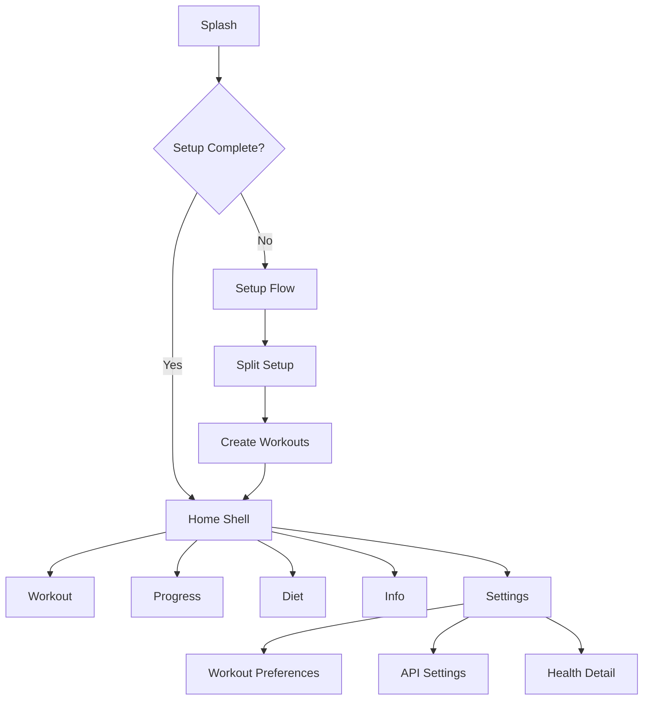

<div align="center">

# Momentum

<sub>*A cycle-based, offline-first fitness tracker that blooms with your progress*</sub>


[](https://flutter.dev)
[](https://dart.dev)
[](LICENSE)

</div>

---

## Purpose

Momentum is a **cycle-based, offline-first fitness tracker** that advances your workout split only when a workout is completed—like cherry blossoms that bloom in their own time, not on a calendar's schedule.

---

## Problem Statement

Calendar-driven fitness apps tie progression to days on a schedule. Momentum replaces that with a **cycle-based progression system** that advances only after completed sessions, keeping progression aligned with actual training—letting your fitness journey unfold naturally.

---

## Core Idea and Motivation

> *"The flower that blooms in adversity is the most rare and beautiful of all."*

The app is built around **cycle-based progression** instead of daily scheduling. It removes calendar pressure and lets the training cycle move forward only when a workout is completed—honoring your rhythm, not the clock's.

---

## Features

<table>
<tr><td>

### Training & Progress
- Cycle-based progression using split index and completion logic
- Workout tracking with sessions, exercises, sets, reps, and weights
- Progress analytics with beautiful charting via fl_chart
- Personal records and achievement tracking

</td><td>

### Data & Sync
- Offline-first storage using Drift (SQLite) with versioned schema
- Health Connect integration for workouts, sleep, and nutrition
- Background sync via Workmanager (4-hour intervals)
- Export/Import support with share_plus and file_picker

</td></tr>
<tr><td>

### Intelligence & Insights
- AI integration via Google Gemini with secure API key storage
- Home screen widget updates using home_widget
- Local notifications for workout reminders
- Smart suggestions for deload weeks and recovery

</td><td>

### Experience & Design
- Material 3 theming with OLED Black and Heavenly modes
- 3D recovery model using WebView + Three.js + GLTF
- Media capture via camera and image_picker
- High refresh-rate display on supported devices

</td></tr>
</table>

---

## App Architecture and Data Flow

```
┌─────────────────────────────────────────────────────────┐
│                    Momentum App                          │
├─────────────────────────────────────────────────────────┤
│                                                         │
│  ┌───────────┐    ┌──────────┐    ┌──────────────┐   │
│  │  Splash   │───▶│  Setup   │───▶│  Main Shell  │   │
│  └───────────┘    └──────────┘    └──────┬───────┘   │
│                                           │            │
│  ┌────────────────────────────────────────┼───────┐   │
│  │  StatefulShellRoute (Bottom Nav)      │       │   │
│  ├────────────────────────────────────────┼───────┤   │
│  │   Home  │  Workout │  Progress │  Diet │       │   │
│  └────────────────────────────────────────┴───────┘   │
│                                                         │
│  ┌─────────────────────────────────────────────────┐   │
│  │           Riverpod Providers                    │   │
│  │  ┌──────────┐  ┌──────────┐  ┌──────────┐     │   │
│  │  │ Database │  │ Workout  │  │  Health  │     │   │
│  │  │ Provider │  │ Provider │  │ Provider │     │   │
│  │  └────┬─────┘  └────┬─────┘  └────┬─────┘     │   │
│  └───────┼─────────────┼─────────────┼───────────┘   │
│          │             │             │                │
│  ┌───────▼─────────────▼─────────────▼───────────┐   │
│  │         Drift SQLite Database                 │   │
│  │  ┌──────┐ ┌─────────┐ ┌─────────┐ ┌──────┐  │   │
│  │  │Users │ │Workouts │ │Sessions │ │ Logs │  │   │
│  │  └──────┘ └─────────┘ └─────────┘ └──────┘  │   │
│  └─────────────────────────────────────────────┘   │
│                                                         │
│  ┌─────────────────────────────────────────────────┐   │
│  │           Background Services                   │   │
│  │  • Workmanager (Health Sync)                   │   │
│  │  • Notifications (Reminders)                   │   │
│  │  • Widget Updates (Home Screen)                │   │
│  └─────────────────────────────────────────────────┘   │
└─────────────────────────────────────────────────────────┘
```

**High-level flow:**
1. App startup initializes system UI, notifications, and Workmanager
2. Riverpod providers access services and data reactively
3. Data is stored locally in Drift (SQLite)
4. Health data syncs from Health Connect on a periodic schedule
5. Widgets refresh using a dedicated widget service
6. UI is driven by GoRouter with declarative route configuration

---

## Tech Stack

<div align="center">

| Category | Technology | Version |
|:--------:|:----------:|:-------:|
| Framework | Flutter | 3.10.7 |
| Language | Dart | ^3.10.7 |
| State | Riverpod | 2.6.1 |
| Database | Drift | 2.20.2 |
| Routing | GoRouter | 14.2.0 |
| Theme | Dynamic Color | 1.7.0 |
| Fonts | Google Fonts | 6.2.1 |
| Charts | FL Chart | 0.68.0 |
| Background | Workmanager | 0.9.0+3 |
| Health | Health Connect | 11.0.0 |
| 3D Viewer | Model Viewer | 1.10.0 |
| WebView | WebView Flutter | 4.8.0 |
| Storage | Secure Storage | 9.2.2 |
| Notifications | Local Notifications | 17.2.2 |

</div>

---

## Folder and File Structure

```
momentum/
├── assets/
│   ├── images/          # App icons and images
│   └── 3d/              # GLTF models and Three.js viewer
│
├── lib/
│   ├── app/
│   │   ├── app.dart              # Root widget & theme wiring
│   │   ├── router.dart           # GoRouter configuration
│   │   └── theme/
│   │       └── app_theme.dart    # OLED Black & Heavenly themes
│   │
│   ├── core/
│   │   ├── database/             # Drift tables & queries
│   │   ├── models/               # Data models
│   │   ├── providers/            # Riverpod providers
│   │   ├── services/             # Background sync, notifications
│   │   ├── utils/                # Shared utilities
│   │   └── widgets/              # Shared widgets
│   │
│   └── features/
│       ├── home/                 # Dashboard & recovery viz
│       ├── workout/              # Session tracking
│       ├── progress/             # Analytics & charts
│       ├── diet/                 # Nutrition & AI assistant
│       ├── settings/             # Theme & preferences
│       ├── splash/               # Loading screen
│       ├── setup/                # Onboarding
│       ├── health/               # Health Connect
│       └── info/                 # Profile & analytics
│
└── test/                         # Test suite
```

---

## Navigation Flow

<div align="center">



</div>

**Available Routes:**
- `/` - Splash screen
- `/setup` - Initial setup
- `/split-setup` - Split configuration
- `/create-workout/:index/:total` - Workout builder
- `/home` - Main dashboard
- `/workout` - Active session
- `/diet` - Nutrition tracking
- `/progress` - Analytics
- `/info` - Profile
- `/settings` - Preferences
- `/workout-preferences` - Workout config
- `/health` - Health Connect
- `/api-settings` - API keys
- `/privacy` - Privacy policy
- `/recovery-3d` - 3D recovery model
- `/user-analytics` - User stats

---

## 3D Model Usage and Purpose

The app includes a **3D recovery model** rendered via WebView and Three.js, backed by a GLTF mannequin. It visualizes:

- Muscle recovery status with color-coded heatmaps
- Interactive poses (IDLE, FIGHT, GUARD, PUNCH)
- Boxing game mode with AI opponent (v3.0-FIGHTER)
- Procedural animations with physics-based reactions

---

## Performance Considerations

- High refresh-rate mode enabled on supported Android devices
- Edge-to-edge UI for modern gesture navigation
- Smart background sync every 4 hours with battery/network constraints
- Offline-first storage keeps the app functional without network

---

## Known Limitations

- Android-only build configuration (iOS not supported)
- Health data sync is opt-in and depends on Health Connect
- No cloud sync configured (by design—offline-first)

---

## Setup Instructions

### Prerequisites
```bash
✓ Flutter SDK 3.10.7 or later
✓ Android SDK (min SDK 21)
✓ Android emulator or physical device
```

### Installation

```bash
# 1. Install dependencies
flutter pub get

# 2. Generate code (Riverpod, Drift, Freezed)
dart run build_runner build --delete-conflicting-outputs

# 3. Run the app
flutter run
```

---

## Build and Run Steps

```bash
# Debug APK
flutter build apk --debug

# Release APK (split by ABI for smaller size)
flutter build apk --release --split-per-abi

# App Bundle (for Google Play)
flutter build appbundle --release
```

---

## Environment Variables and Configs

- AI API keys are stored in secure storage (no .env file)
- Configuration is managed through the settings screen
- Theme selection persists via shared preferences

---

## Platform Support

- Android (min SDK 21 / Android 5.0 Lollipop)
- iOS (not configured in current build)

---

## Screens and Modules Overview

| Screen | Purpose | Key Features |
|:------:|:-------:|:-------------|
| Splash | Entry point | Permission handling, initialization |
| Setup | Onboarding | Profile creation, split configuration |
| Home | Dashboard | Heatmap, 3D model, quick stats |
| Workout | Session tracking | Exercise logging, rest timer, PRs |
| Progress | Analytics | Charts, volume trends, records |
| Diet | Nutrition | AI assistant, food logs, macros |
| Health | Health Connect | Sync settings, data permissions |
| Info | Profile | User analytics, achievements |
| Settings | Preferences | Theme, API keys, workout config |

---

## Contribution Guidelines

```
- Fork the repository
- Create a feature branch
- Run code generation before committing
- Ensure tests and analysis pass:
   • flutter test
   • flutter analyze
- Open a pull request with clear description
```

---

## License

This project is licensed under the **MIT License**.

---

<div align="center">

### Built with care for those who train at their own pace


*May your fitness journey bloom beautifully*

---

**Momentum** • *Cycle-based progression, naturally* • v1.0.0

</div>